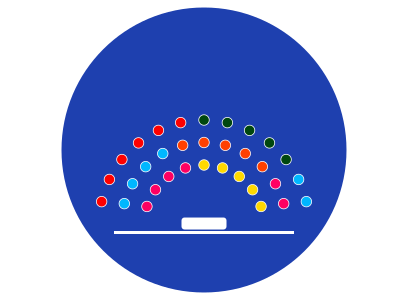

# Configurable Open-source Voting & Decentralized Election Venue - C.O.V.D.E.V / Sistema Votazioni del Comitato Studentesco

<p align="center">
  
</p>

C.O.V.D.E.V è un’app Next.js + Solidity per gestire e visualizzare le votazioni del Comitato Studentesco, con interfaccia moderna (dark/light), emiciclo in stile parlamento e integrazione con wallet (MetaMask).

<p align="center">
  <a href="https://github.com/DuPont9029/comitato-sc"></a>
  <a href="https://github.com/DuPont9029/comitato-sc"></a>
  
  
  
  
  
  
</p>


 [](https://starchart.cc/DuPont9029/C.O.V.D.E.V)


## 🚀 Caratteristiche
- Emiciclo dinamico: riempimento dei seggi in base ai voti, simmetrico dal centro verso l’esterno.
- Stato utente: rappresentante, diritto di voto, ha già votato.
- Area Proposte: elenco e gestione, dropdown con troncamento (nessun overflow).
- Area Studenti: voto per ID proposta (con diritto di voto).
- Dark/Light mode curata: in light mode pannelli bianchi (Emiciclo/Area Studenti) come "Stato Utente".

## 🧰 Stack
- Next.js (App Router) • TypeScript
- Ethers.js • Solidity
- Tailwind-like utility classes (via CSS/JSX)

## 📦 Setup
```bash
pnpm install
pnpm dev
# Apri http://localhost:3000/
```

## 🔗 Contratto
- File: `contratto.sol`
- Configurazione: imposta `CONTRACT_ADDRESS` in `lib/contract.ts` dopo il deploy.
- ABI: già presente in `lib/contract.ts` (`CONTRACT_ABI`). Aggiorna se modifichi il contratto.

### Deploy rapido (Remix)
1. Apri https://remix.ethereum.org e carica `contratto.sol`.
2. Compila e fai deploy sulla rete (testnet ok).
3. Copia l’indirizzo del contratto e incollalo in `lib/contract.ts`.

## 🗂️ Struttura
- `app/page.tsx` — UI, logica client, emiciclo SVG.
- `app/layout.tsx` — metadata, font, favicon SVG (`/public/favicon.svg`).
- `lib/contract.ts` — indirizzo + ABI.
- `public/` — asset (favicon, icone, svg).

## 📊 Statistiche della Repo
- Link repo: https://github.com/DuPont9029/comitato-sc
- Stelle: 
- Forks: 
- Ultimo commit: 
- Dimensione repo: 
- Lingue:  


## 🧪 Script
- Sviluppo: `pnpm dev`
- Build: `pnpm build` → `pnpm start`
- Lint: `pnpm lint`

## 🧭 UX & Note
- Dropdown con nomi lunghi: troncato con ellissi, niente overflow; tooltip via `title` mostra il nome completo.
- Emiciclo: rendering client-side per evitare mismatch di idratazione.
- Favicon: SVG come primaria, fallback ICO (cache aggressiva: hard reload `Cmd+Shift+R`).

## 🔒 Sicurezza
- Nessuna chiave privata nel frontend. Le transazioni usano il wallet del browser (`BrowserProvider`).
- Verifica rete e account in MetaMask prima di votare.

## 🛠️ Troubleshooting
- L’emiciclo non appare correttamente: assicurati che il mount client sia attivo (hook dedicato).
- Dropdown sfora: regola la larghezza `w-[180px]` in `app/page.tsx` se serve.

## 🗺️ Roadmap
- probabilmente dovrò fixare l'emiciclo
- Storico votazioni e filtri.
- Test E2E/unit per componenti chiave.

---

Se ti piace, lascia una ⭐
